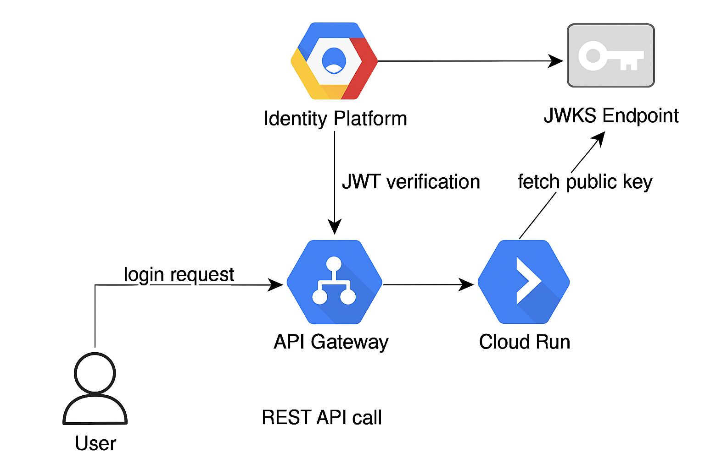

# Cloud Run + Identity Platform + API Gateway Setup

This guide explains how to deploy your Go backend to Cloud Run, secure it with Identity Platform, and configure API Gateway to verify Identity Platform-issued JWTs.

## Prerequisites
Enable APIs
- API Gateway API: API Gateway enables you to provide secure access to your services.
- Service Control API: Provides control plane functionality to managed services, such as logging, monitoring, and status checks
- Service Management API: Service Management allows service producers to publish their services on Google Cloud Platform 

**GCP Identity Platform Architecture:**



## 1. Deploy Go Backend to Cloud Run

#### 1. Build and push your container image:
```sh
    gcloud builds submit --tag gcr.io/<PROJECT_ID>/<SERVICE_NAME>
```

- Add docker image `gcr.io/ksquare-mchavez/identity-api` on GCP(Container Registry):
```sh
    gcloud builds submit --tag gcr.io/ksquare-mchavez/identity-api
```

- Replace service using region (Optional)
```sh
  gcloud run services replace <SERVICE-FILE.yaml> --region <REGION_NAME>

  Ex.: gcloud run services replace cloudrun.yaml --region us-east1
```
- Describe service using region (Optional)
```sh
  gcloud run services describe <SERVICE_NAME> --region <REGION_NAME>

  Ex.: gcloud run services describe identity-api --region us-east1
```
#### 2. Deploy to Cloud Run:
```sh
gcloud run deploy <SERVICE_NAME> \
  --image gcr.io/<PROJECT_ID>/<SERVICE_NAME> \
  --platform managed \
  --region <REGION> \
  --allow-unauthenticated
```
Deploy container to Cloud Run service `identity-api` in project `ksquare-mchavez` region `us-east1`. \
Do not include env variables on this script(Recommended). You can update the env variables later.
```sh
gcloud run deploy identity-api \
  --image gcr.io/ksquare-mchavez/identity-api \
  --set-env-vars GCP_IDENTITY_API_KEY=my-api-key,GCP_PROJECT_ID=ksquare-mchavez,GCP_SHOW_PUBLIC_KEYS=false \
  --region us-east1 \
  --no-allow-unauthenticated
```
You can get the apiKey for you Identity providers as follow:
- Go to `Identity platform`, then `providers` and click on `Application setup details`. 

```
<script src="https://www.gstatic.com/firebasejs/8.0/firebase.js"></script>
<script>
  var config = {
    apiKey: "{API_KEY}", # This is your api-key
    authDomain: "demo.firebaseapp.com",
  };
  firebase.initializeApp(config);
</script>
```
You will see your apiKey under config. Now you can set GCP_IDENTITY_API_KEY with this value.
## 2. Enable Identity Platform
- In Google Cloud Console, enable Identity Platform for your project.
- Configure authentication providers (e.g., Email/Password, Google, etc.).

## 3. Create API Gateway Config
Create an OpenAPI spec (e.g. `openapi.yaml`or `api-gateway.yaml`) for your API Gateway Definition. 
Update `x-google-issuer` and `x-google-jwks_uri` to tell the gateway how to verify JWTs.

Add the following to the security definition in your API config, which follows the [OpenAPI 2.0 security scheme](https://swagger.io/specification/v2/#securityDefinitionsObject)
```yaml
securityDefinitions:
  your_custom_auth_id:
    authorizationUrl: ""
    flow: "implicit"
    type: "oauth2"
    # The value below should be unique
    x-google-issuer: "https://securetoken.google.com/<PROJECT_ID>" # issuer of the token
    x-google-jwks_uri: "https://www.googleapis.com/service_accounts/v1/jwk/securetoken@system.gserviceaccount.com" # url to the public key
    x-google-audiences: "<PROJECT_ID>"

security:
  - your_custom_auth_id: []

paths:
  /your-endpoint:
    get:
      security:
        - your_custom_auth_id: []
      ...
```
You can define multiple security definitions in the API config, but each definition must have a different issuer. 
If you use security sections at both the API level and at the method level, the method-level settings override the API-level settings.

Please check `api-gateway.yaml` for further details.

## 4. Deploy API Gateway
#### 1. Create an API config:
```sh
gcloud api-gateway api-configs create <CONFIG_ID> \
  --api=<API_ID> \
  --openapi-spec=openapi.yaml \
  --project=<PROJECT_ID>
```
Create OpenAPI 2 config `identity-api-config` then validate --> https://editor.swagger.io/ (Recommended): 
```sh
gcloud api-gateway api-configs create identity-api-config \
  --api=identity-api \
  --openapi-spec=api-gateway.yaml \
  --project=ksquare-mchavez \
  --backend-auth-service-account=ksquare-mchavez-sa@ksquare-mchavez.iam.gserviceaccount.com
```
Note: You can Create or Redeploy your API config file using the same script.
#### 2. Create and deploy the API Gateway:
```sh
gcloud api-gateway gateways create <GATEWAY_ID> \
  --api=<API_ID> \
  --api-config=<CONFIG_ID> \
  --location=<REGION> \
  --project=<PROJECT_ID>
```
Create gateway `identity-gateway`(Recommended):
```sh
gcloud api-gateway gateways create identity-gateway \
  --api=identity-api \
  --api-config=identity-api-config \
  --location=us-east1
```
- Redeploy/Update your gateway
```sh
gcloud api-gateway gateways update identity-gateway \
  --api=identity-api \
  --api-config=identity-api-config \
  --location=us-east1
```
## 5. Test JWT Verification
- Call your API Gateway endpoint with an Identity Platform-issued JWT in the `Authorization: Bearer <token>` header.
- API Gateway will verify the JWT using the issuer and JWKS URI.

#### 1. Public Login (Gateway)
```sh
curl -X POST https://YOUR_GATEWAY_URL/login \
  -d '{"email":"user@example.com","password":"mypassword"}' \
  -H "Content-Type: application/json"
```
#### 2. Protected Endpoint (Gateway)
```sh
curl -X GET https://YOUR_GATEWAY_URL/secure/decode-token \
  -H "Authorization: Bearer <ID_TOKEN>"
```

## References
- [Cloud Run documentation](https://cloud.google.com/run/docs/)
- [Identity Platform](https://cloud.google.com/security/products/identity-platform?hl=en)
- [API Gateway documentation](https://cloud.google.com/api-gateway/docs)

## Troubleshooting
#### Confirm your Identity Platform project ID
```sh
gcloud config get-value project
```
#### Disable unauthenticated access
```sh
gcloud run services update <SERVICE_NAME> --no-allow-unauthenticated
```
Ex.:
```sh
gcloud run services update identity-api --no-allow-unauthenticated
```
#### Require authentication with IAM
```sh
gcloud run services add-iam-policy-binding identity-api \
  --member="serviceAccount:ksquare-mchavez-sa@ksquare-mchavez.iam.gserviceaccount.com" \
  --role="roles/run.invoker"
```

## Notes: 
In Google Cloud API Gateway, when you configure a backend using the `x-google-backend` directive, the gateway does not forward the original Authorization header to your backend by default. 
Instead, it injects its own service-to-service identity token (to authenticate itself to the backend).
To get the original Authorization header (the one sent by the client), you have to preserve it explicitly by copying it into another header before it’s replaced.

Therefore, When the API Gateway on Google Cloud Platform handles requests, 
it performs token validation and can modify or add authentication-related information before forwarding the request to your backend service.
Specifically, if you are using authentication methods like JWT validation, API Gateway will validate the incoming token. 
If the backend address is specified by `x-google-backend` in the API config, API Gateway will override the original Authorization header. 
Instead of the original Authorization header, API Gateway sends the authentication result to the backend in the `X-Apigateway-Api-Userinfo` header. This header is base64url encoded and contains the JWT payload. 

Additionally, when your backend service receives a request that has passed through API Gateway with authentication configured, 
you should retrieve user information and authentication details from the `X-Apigateway-Api-Userinfo` header, rather than relying on the original Authorization header. This ensures that your backend correctly processes the validated and potentially modified authentication context provided by API Gateway.

