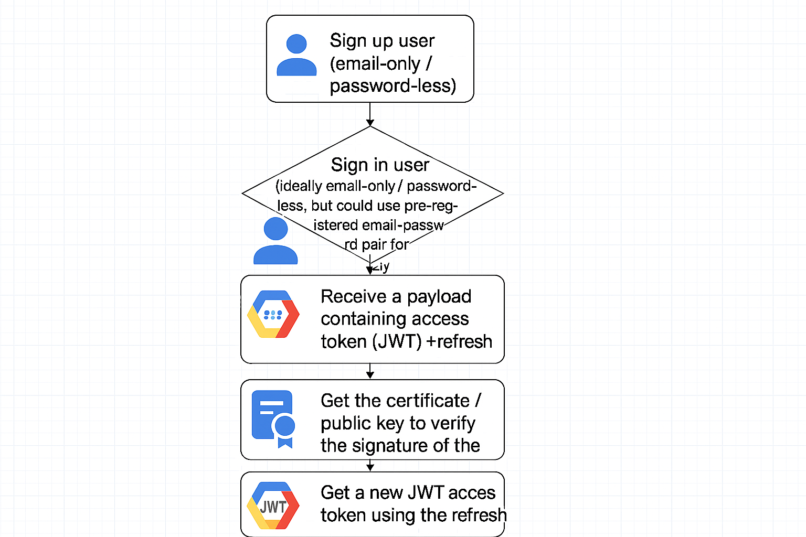
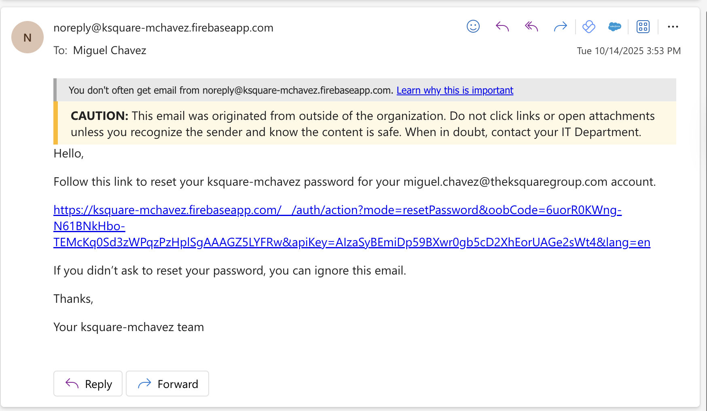

# Proof of Concept: GCP Identity Platform API Integration


## Document Purpose
This document provides:
  - **Setup instructions**
  - **API endpoints for key operations**
  - **Sample curl commands**

**Goals:**
  1. Sign up user (email-only / password-less)
  2. Sign in user (email-only / password-less, or with pre-registered credentials)
  3. Receive access token (JWT) and refresh token
  4. Get the certificate/public key to verify JWT signature
  5. Get a new JWT access token using the refresh token

This guide is intended for iOS engineers implementing client-side logic.


**Expected Flow:**



---

## Setup Instructions
You’ll need:
  - A GCP project with Identity Platform enabled
  - A configured email/password provider or email link (passwordless)
  - Your Web API key (from GCP Console → Identity Platform → Settings → Web API Key)


## Key Operations & Endpoints


### 1. Sign Up User (Email-only / Password-less)


#### Send Password Reset Email
Used to send one-time _out-of-band_ (OOB) codes (e.g., email verification, password reset) to users.

  - With Google Identity Platform (advanced Firebase Auth)
  - Firebase generates a one-time OOB action code internally and sends the link to the user's email (using default/configured template)
  - The API response does **not** contain the actual OOB link (for security reasons). That’s the expected behavior (these links can directly reset a password or verify an email).

**Reference:** [Send Password Reset Email (Google Docs)](https://cloud.google.com/identity-platform/docs/use-rest-api#section-send-password-reset-email)

**Sample curl:**
```sh
curl 'https://identitytoolkit.googleapis.com/v1/accounts:sendOobCode?key=[API_KEY]' \
  -H 'Content-Type: application/json' \
  --data-binary '{"requestType":"PASSWORD_RESET","email":"[user@example.com]"}'
```

**Sample Response:**
```json
{
  "kind": "identitytoolkit#GetOobConfirmationCodeResponse",
  "email": "[user@example.com]"
}
```

**Sample Email:**



---

### 2. Sign In User (Pre-Registered Credentials)

#### Sign In With Email + Password
Sign in a user with an email and password by issuing an HTTP POST request to the `signInWithPassword` endpoint.

**Reference:** [Sign in pre-registered user (Google Docs)](https://cloud.google.com/identity-platform/docs/use-rest-api#section-sign-in-email-password)

**Sample curl:**
```sh
curl 'https://identitytoolkit.googleapis.com/v1/accounts:signInWithPassword?key=[API_KEY]' \
  -H 'Content-Type: application/json' \
  --data-binary '{"email":"[user@example.com]","password":"[PASSWORD]","returnSecureToken":true}'
```

**Sample Response:**
```json
{
  "localId": "ZY1rJK0eYLg...",
  "email": "[user@example.com]",
  "displayName": "",
  "idToken": "[ID_TOKEN]",
  "registered": true,
  "refreshToken": "[REFRESH_TOKEN]",
  "expiresIn": "3600"
}
```
  - `idToken`: JWT you can verify on your backend
  - `refreshToken`: use to renew session without re-login


#### Sign In Anonymously
Sign in a user anonymously by issuing an HTTP POST request to the `signUp` endpoint.
Anonymous Sign-in must be enabled in your project settings.

**Reference:** [Sign in anonymously (Google Docs)](https://cloud.google.com/identity-platform/docs/use-rest-api#section-sign-in-anonymously)

**Sample curl:**
```sh
curl 'https://identitytoolkit.googleapis.com/v1/accounts:signUp?key=[API_KEY]' \
  -H 'Content-Type: application/json' \
  --data-binary '{"returnSecureToken":true}'
```

**Sample Response:**
```json
{
  "idToken": "[ID_TOKEN]",
  "email": "",
  "refreshToken": "[REFRESH_TOKEN]",
  "expiresIn": "3600",
  "localId": "Jws4SVjpT..."
}
```
  - `idToken`: JWT you can verify on your backend
  - `refreshToken`: use to renew session without re-login


#### Sign In User (Email-only / Password-less)
- GCP Identity Platform does **not** support signing in users with email only.

---

### 3. Receive Access Token (JWT) and Refresh Token
When you sign in with a pre-registered user (`signInWithPassword`) or anonymously, you’ll receive both an Access Token (JWT) and a Refresh Token. In either case, the response will include the following fields:

**Sample Response:**
```json
{
  "idToken": "[ID_TOKEN]",
  "email": "",
  "refreshToken": "[REFRESH_TOKEN]",
  "expiresIn": "3600",
  "localId": "Jws4SVjpT..."
}
```

---

### 4. Get the Certificate/Public Key to Verify JWT Signature
Google-managed key pairs are automatically rotated and used for signing for a maximum of two weeks. The rotation process is probabilistic; usage of the new key will gradually ramp up and down over the key’s lifetime.

You can get the Google Public Signing Keys used by GCP Identity Platform using this JWKS Endpoint:
[https://www.googleapis.com/service_accounts/v1/jwk/securetoken@system.gserviceaccount.com](https://www.googleapis.com/service_accounts/v1/jwk/securetoken@system.gserviceaccount.com)

**Reference:** [Oauth 2.0 JWK rotate period (Google Docs)](https://discuss.google.dev/t/oauth-2-0-jwk-rotate-period/133471)

**Sample Output:**
```json
{
  "keys": [
    {
      "kid": "a5a005e97cb1e427300e52cdd50f0b36cd80629b",
      "e": "AQAB",
      "kty": "RSA",
      "alg": "RS256",
      "n": "rYmjgQOtXjOBB9YLLmRGLopC5465C7f_RNJfsZRB0X599gUPVUZ1tgWvQKWPaQ20H8mH7HHZa9--umXHFmg8urHdNaqOP-Ox51m9817ve0mFVqz1l7gN0Dx6UXLKDiHvxa4-pCale62wnmfFJdxtNYTaHICZPiY7FFVhIcTkZxulEni_crdnMirOcNXcHUouEX0Vp_d4JycALHolANj31zrMlmp6LopxpzJTxWiIHrW4nZ9v6I1LmoUKVI0Ll-Gj_qIh-7KQk_AhP3k0R2Bk-lOAY8WkZ3-rWG2wvmERsWZZx06uSQni2NRMPXbajXD1ogXAOy9xHb6aDcXb6CR4Gw",
      "use": "sig"
    },
    {
      "kid": "9d2130fef02587fd88618869822734ef76a11165",
      "kty": "RSA",
      "n": "viEkDYFahRPiz5LeAq1cXC46HAYZN9oTm9EZQKSagxvWzypsZ4xgYALtw4LVcHXAGMMtWLmCtTO0d5-5ZPf75PI7siqMsMOlrqV2WSLH3eqawY5JGKCFpjSqRwGAzJxAwLe3RfbPO8NyE3bsHVevrRgpkuzOfy-yweNxlQFJWj22mvfznnJoo463wyCjd-mboq_wgrkfsBh09upufh5Q1e-W_NtdrzxcAQ4-NJFkVP6XAYrmi_LRXGL3Zb1dVp6V-pk3BM1qqV5ZTL46h5F58IYIZ7Q4BB1ZuWvT5EX5mjbo206HWJvoLuVMcNzkYjMIZstlBxU0RniyhoLS4r7I4Q",
      "use": "sig",
      "e": "AQAB",
      "alg": "RS256"
    }
  ]
}
```

**General Information:**
  - For Firebase Auth / Google Identity, the JWKS is here: [https://www.googleapis.com/service_accounts/v1/jwk/securetoken@system.gserviceaccount.com](https://www.googleapis.com/service_accounts/v1/jwk/securetoken@system.gserviceaccount.com)
  - The well-known JWKS endpoint for Google OAuth2 is: [https://www.googleapis.com/oauth2/v3/certs](https://www.googleapis.com/oauth2/v3/certs)


### 5. Get a New JWT Access Token Using the Refresh Token
You can refresh an Identity Platform ID token by issuing an HTTP POST request to the `token` endpoint.

**Reference:** [Exchange a refresh token for an ID token (Google Docs)](https://cloud.google.com/identity-platform/docs/use-rest-api#section-refresh-token)

**Sample curl:**
```sh
curl 'https://securetoken.googleapis.com/v1/token?key=[API_KEY]' \
-H 'Content-Type: application/x-www-form-urlencoded' \
--data 'grant_type=refresh_token&refresh_token=[REFRESH_TOKEN]'
```

**Sample Response:**
```json
{
  "access_token": "[ACCESS_TOKEN]",
  "expires_in": "3600",
  "token_type": "Bearer",
  "refresh_token": "[REFRESH_TOKEN]",
  "id_token": "[ID_TOKEN]",
  "user_id": "tRcfmLH7o2XrNELi...",
  "project_id": "1234567890"
}
```

---

#### Notes on HIPAA Compliance

- If your project is under Firebase Auth (Firebase Console), it is **not HIPAA compliant**.
- If it is a Google Cloud Identity Platform project with a signed BAA, it **can be HIPAA compliant**.
- Google’s built-in email delivery system sends OOB links.

**Do NOT include PHI in:**
  - Email subject or body templates
  - Action URLs or query parameters

_Note: These emails are not intended for PHI transport; including PHI could break HIPAA compliance._

**For HIPAA-safe email delivery:**
  - Disable automatic OOB emails
  - Use your own secure mail provider
  - Generate and deliver the link yourself via your secure system (no PHI in the URL)

